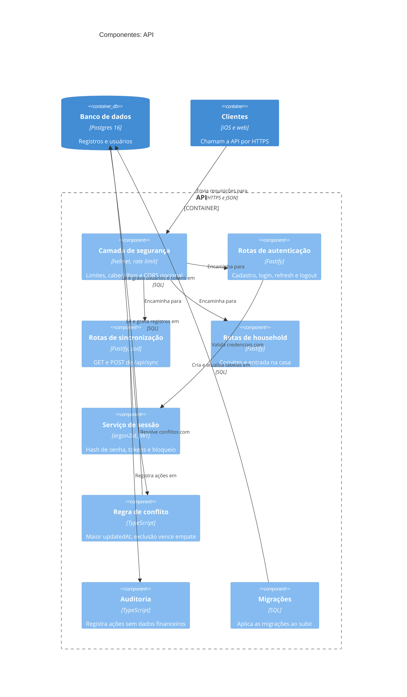

# C4 nível 3: componentes da API

Detalha o interior do contêiner "API" (Node 22, Fastify 5).

```mermaid
C4Component
  title Componentes: API

  ContainerDb(banco, "Banco de dados", "Postgres 16", "Registros e usuários")
  Container(clientes, "Clientes", "iOS e web", "Chamam a API por HTTPS")

  Container_Boundary(api, "API") {
    Component(seguranca, "Camada de segurança", "helmet, rate limit", "Limites, cabeçalhos e CORS opcional")
    Component(rotasAuth, "Rotas de autenticação", "Fastify", "Cadastro, login, refresh e logout")
    Component(rotasSync, "Rotas de sincronização", "Fastify, zod", "GET e POST de /api/sync")
    Component(rotasCasa, "Rotas de household", "Fastify", "Convites e entrada na casa")
    Component(auth, "Serviço de sessão", "argon2id, JWT", "Hash de senha, tokens e bloqueio")
    Component(conflito, "Regra de conflito", "TypeScript", "Maior updatedAt, exclusão vence empate")
    Component(auditoria, "Auditoria", "TypeScript", "Registra ações sem dados financeiros")
    Component(migracoes, "Migrações", "SQL", "Aplica as migrações ao subir")
  }

  Rel(clientes, seguranca, "Envia requisições para", "HTTPS e JSON")
  Rel(seguranca, rotasAuth, "Encaminha para")
  Rel(seguranca, rotasSync, "Encaminha para")
  Rel(seguranca, rotasCasa, "Encaminha para")
  Rel(rotasAuth, auth, "Valida credenciais com")
  Rel(rotasSync, conflito, "Resolve conflitos com")
  Rel(rotasSync, auditoria, "Registra ações em")
  Rel(auth, banco, "Lê e grava usuários e tokens em", "SQL")
  Rel(conflito, banco, "Lê e grava registros em", "SQL")
  Rel(migracoes, banco, "Cria e atualiza tabelas em", "SQL")

  UpdateLayoutConfig($c4ShapeInRow="3", $c4BoundaryInRow="1")
```
