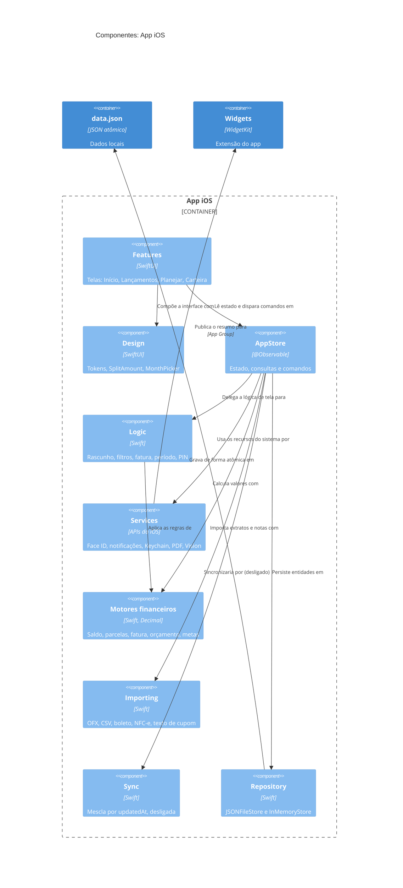

# C4 nível 3: componentes do app iOS

Detalha o interior do contêiner "App iOS". As camadas de estado e de regras não importam SwiftUI, o que permite testá-las só com o compilador Swift.

```mermaid
C4Component
  title Componentes: App iOS

  Container(arquivoLocal, "data.json", "JSON atômico", "Dados locais")
  Container(widgets, "Widgets", "WidgetKit", "Extensão do app")

  Container_Boundary(ios, "App iOS") {
    Component(telas, "Features", "SwiftUI", "Telas: Início, Lançamentos, Planejar, Carteira")
    Component(componentes, "Design", "SwiftUI", "Tokens, SplitAmount, MonthPicker")
    Component(appStore, "AppStore", "@Observable", "Estado, consultas e comandos")
    Component(logica, "Logic", "Swift", "Rascunho, filtros, fatura, período, PIN")
    Component(servicos, "Services", "APIs do iOS", "Face ID, notificações, Keychain, PDF, Vision")
    Component(motores, "Motores financeiros", "Swift, Decimal", "Saldo, parcelas, fatura, orçamento, metas")
    Component(importacao, "Importing", "Swift", "OFX, CSV, boleto, NFC-e, texto de cupom")
    Component(sincronizacao, "Sync", "Swift", "Mescla por updatedAt, desligada")
    Component(repositorio, "Repository", "Swift", "JSONFileStore e InMemoryStore")
  }

  Rel(telas, componentes, "Compõe a interface com")
  Rel(telas, appStore, "Lê estado e dispara comandos em")
  Rel(appStore, logica, "Delega a lógica de tela para")
  Rel(appStore, servicos, "Usa os recursos do sistema por")
  Rel(appStore, motores, "Calcula valores com")
  Rel(appStore, importacao, "Importa extratos e notas com")
  Rel(appStore, repositorio, "Persiste entidades em")
  Rel(appStore, sincronizacao, "Sincronizaria por (desligado)")
  Rel(logica, motores, "Aplica as regras de")
  Rel(repositorio, arquivoLocal, "Grava de forma atômica em")
  Rel(servicos, widgets, "Publica o resumo para", "App Group")

  UpdateLayoutConfig($c4ShapeInRow="3", $c4BoundaryInRow="1")
```
