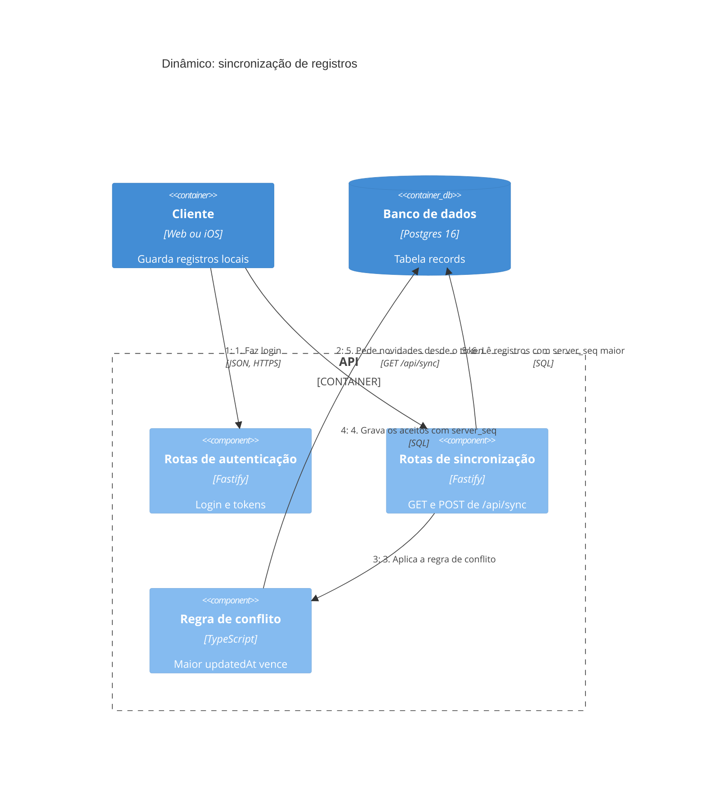

# C4 dinâmico: sincronização de um cliente com a API

Fluxo numerado do envio e do recebimento de registros. O cliente web já faz isso; o cliente do app iOS ainda não foi escrito.

```mermaid
C4Dynamic
  title Dinâmico: sincronização de registros

  Container(cliente, "Cliente", "Web ou iOS", "Guarda registros locais")
  ContainerDb(banco, "Banco de dados", "Postgres 16", "Tabela records")

  Container_Boundary(api, "API") {
    Component(rotasAuth, "Rotas de autenticação", "Fastify", "Login e tokens")
    Component(rotasSync, "Rotas de sincronização", "Fastify", "GET e POST de /api/sync")
    Component(conflito, "Regra de conflito", "TypeScript", "Maior updatedAt vence")
  }

  Rel(cliente, rotasAuth, "1. Faz login", "JSON, HTTPS")
  Rel(cliente, rotasSync, "2. Envia registros alterados", "POST /api/sync")
  Rel(rotasSync, conflito, "3. Aplica a regra de conflito")
  Rel(conflito, banco, "4. Grava os aceitos com server_seq", "SQL")
  Rel(cliente, rotasSync, "5. Pede novidades desde o token", "GET /api/sync")
  Rel(rotasSync, banco, "6. Lê registros com server_seq maior", "SQL")
```
