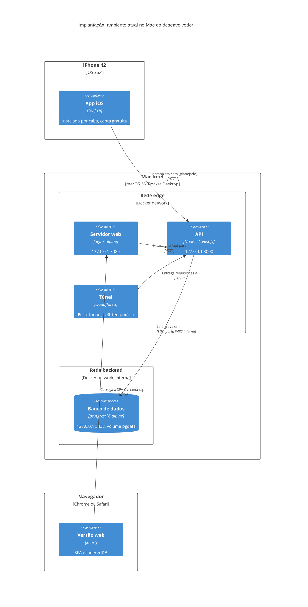

# C4: implantação

Mostra onde cada contêiner roda hoje. O Postgres fica numa rede interna e só é acessível por `127.0.0.1:5433` no Mac. A internet chega apenas à API, pelo túnel.

```mermaid
C4Deployment
  title Implantação: ambiente atual no Mac do desenvolvedor

  Deployment_Node(iphone, "iPhone 12", "iOS 26.4") {
    Container(ios, "App iOS", "SwiftUI", "Instalado por cabo, conta gratuita")
  }

  Deployment_Node(mac, "Mac Intel", "macOS 26, Docker Desktop") {
    Deployment_Node(rede, "Rede edge", "Docker network") {
      Container(nginx, "Servidor web", "nginx:alpine", "127.0.0.1:8080")
      Container(api, "API", "Node 22, Fastify", "127.0.0.1:3000")
      Container(tunel, "Túnel", "cloudflared", "Perfil tunnel, URL temporária")
    }
    Deployment_Node(redeBanco, "Rede backend", "Docker network, interna") {
      ContainerDb(banco, "Banco de dados", "postgres:16-alpine", "127.0.0.1:5433, volume pgdata")
    }
  }

  Deployment_Node(navegador, "Navegador", "Chrome ou Safari") {
    Container(web, "Versão web", "React", "SPA e IndexedDB")
  }

  Rel(web, nginx, "Carrega a SPA e chama /api", "HTTP")
  Rel(nginx, api, "Encaminha /api para", "HTTP")
  Rel(tunel, api, "Entrega requisições à", "HTTP")
  Rel(api, banco, "Lê e grava em", "SQL, porta 5432 interna")
  Rel(ios, api, "Sincronizará com (planejado)", "HTTPS")

  UpdateLayoutConfig($c4ShapeInRow="3", $c4BoundaryInRow="1")
```
